# 🤖 AI Job Board - Intelligent Recruitment Platform

A full-stack **AI-powered recruitment platform** built with **React** and **Flask** that automatically matches candidates with jobs using **intelligent skill analysis** and **compatibility scoring**. This project showcases my expertise in **full-stack development, AI/ML algorithms, and modern web architecture**.

---

##  Features

* **Smart CV Analysis** – AI extracts skills and experience from PDF resumes automatically
* **Intelligent Job Matching** – 0-100% compatibility scores between candidates and positions
* **Real-time Application Tracking** – Live status updates (Pending/Shortlisted/Rejected)
* **AI-Ranked Candidates** – Recruiters see best matches first
* **Role-Based System** – Separate dashboards for candidates and recruiters
* **One-Click Management** – Streamlined application review process

---

##  Tech Stack

* **Frontend:** React 18 (Vite), TailwindCSS, React Router, Axios
* **Backend:** Flask (Python), SQLAlchemy, SQLite, bcrypt
* **AI/ML:** Custom NLP algorithms, Pattern matching, Jaccard similarity
* **Tools:** PyPDF2 for text extraction, Optional Hugging Face integration

---

##  Screenshots

###  Authentication Pages

#### Login Page (`/`)
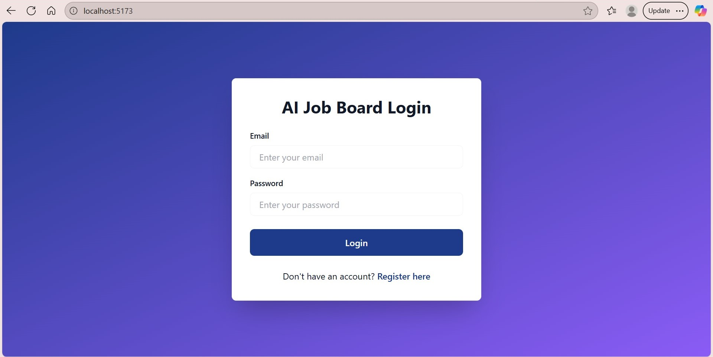
* Clean authentication interface with role-based routing
* Form validation and error handling
* Redirects to appropriate dashboard based on user role

#### Registration Page (`/register`)
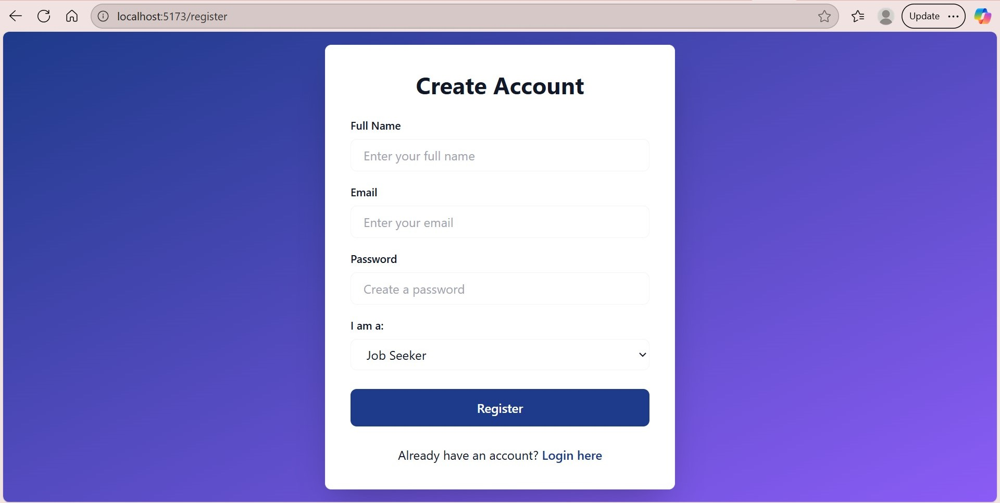
* User registration with role selection (Candidate/Recruiter)
* Password strength validation
* Automatic redirection to login after successful registration

---

###  Candidate Dashboard Pages

#### Candidate Dashboard (`/candidate`)
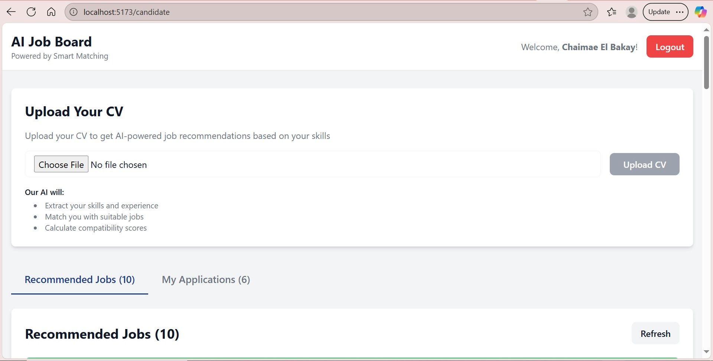
* Main dashboard with CV upload section
* Tab navigation between Recommended Jobs and My Applications
* Quick stats and user greeting

#### CV Upload & AI Analysis
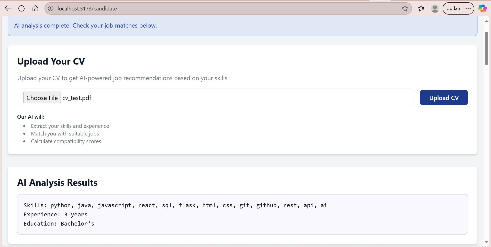
* PDF file upload with validation
* Real-time AI processing and skill extraction
* Display of extracted skills, experience, and education level

#### Recommended Jobs Tab
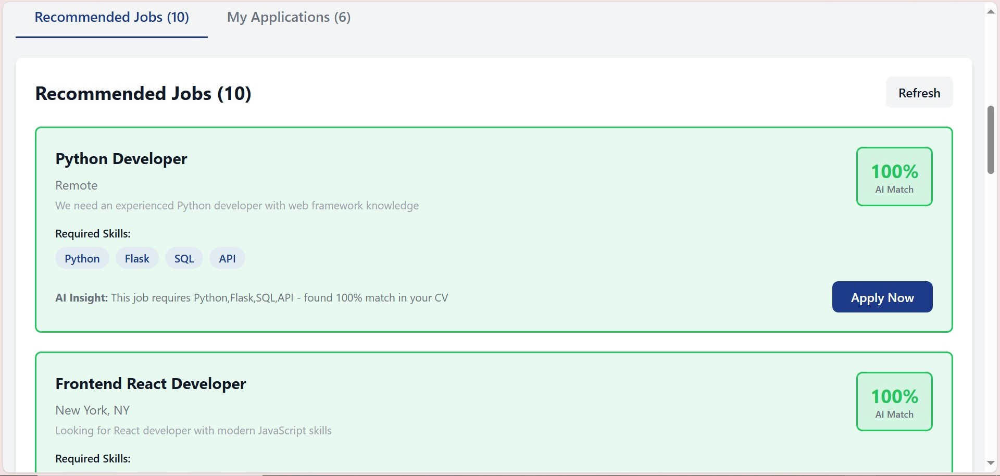
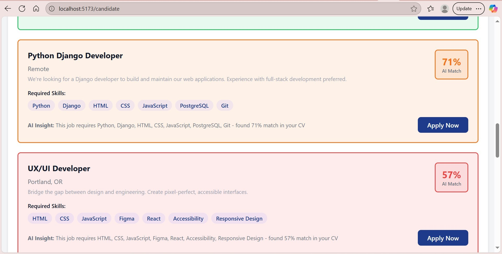
* AI-powered job recommendations with compatibility scores
* Color-coded match indicators (Green/Yellow/Red)
* Skills breakdown and one-click application
* AI insights explaining match reasons

#### My Applications Tab
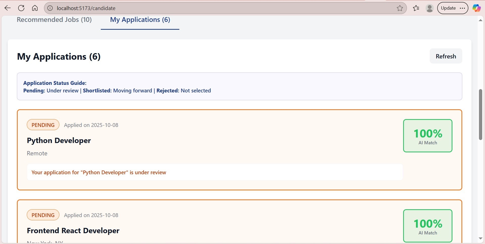
* Application history with real-time status tracking
* Color-coded status badges (Pending/Shortlisted/Rejected)
* Application dates and match scores
* Status messages and encouragement notes

---

###  Recruiter Dashboard Pages

#### Recruiter Dashboard (`/recruiter`)
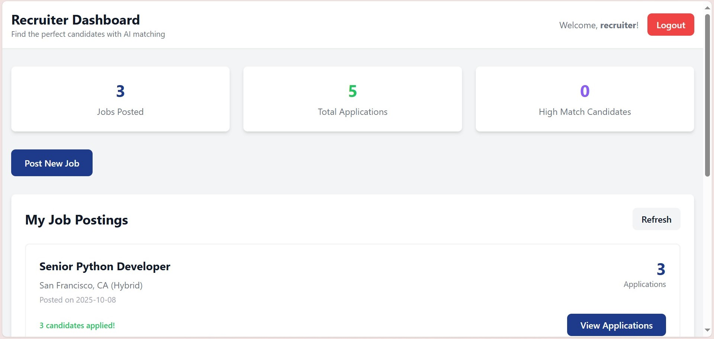
* Overview dashboard with job posting analytics
* Quick stats: Jobs Posted, Total Applications, High-Match Candidates
* Job creation form toggle

#### Job Creation Form
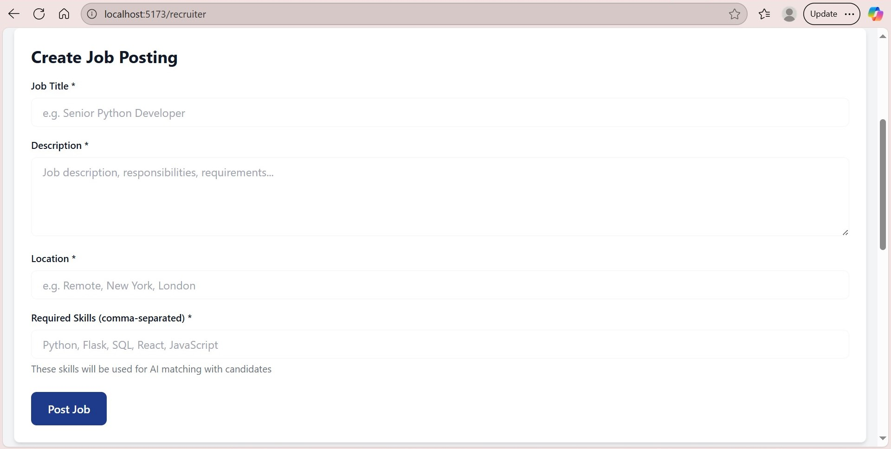
* Comprehensive job posting form
* Skills input with AI matching optimization
* Form validation and success feedback

#### My Job Postings
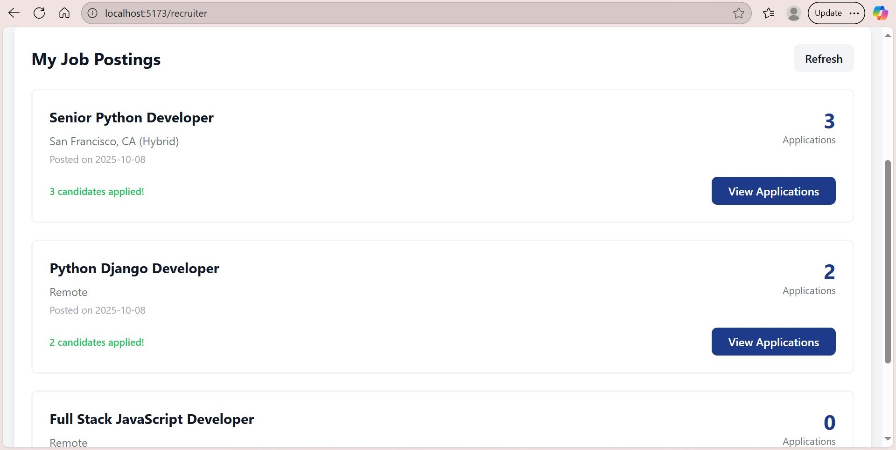
* List of all posted jobs with application counts
* Application statistics and quick actions
* View applications button for each position

#### Candidate Applications View
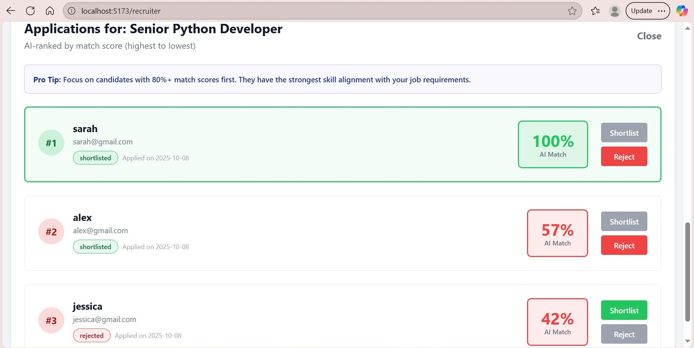
* AI-ranked candidate list for each job
* Color-coded match scores and ranking
* One-click shortlist/reject functionality


#### Status Badges
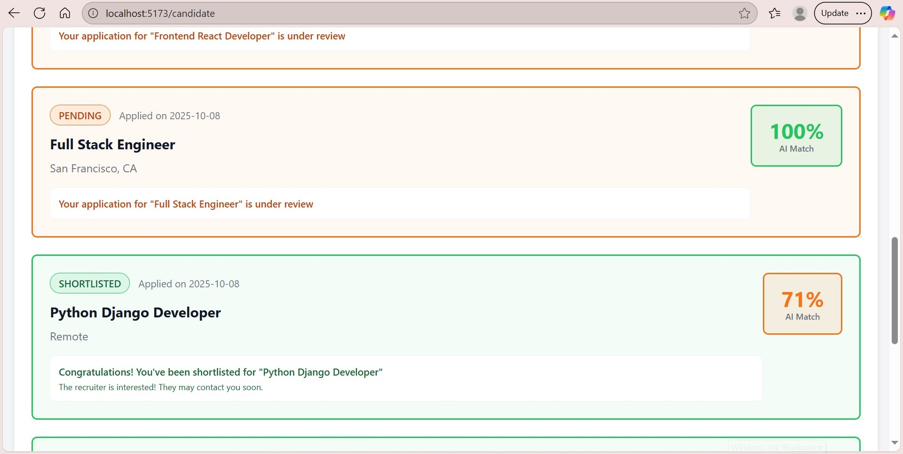
* Visual status indicators with icons
* Color-coded: Yellow (Pending), Green (Shortlisted), Red (Rejected)
* Consistent across candidate and recruiter views


---

##  Structure

```
ai-job-board/
├── backend/        # Flask API & AI engine
│   ├── app.py
│   ├── ai_service.py
│   └── models.py
├── frontend/       # React UI
│   └── src/
└── README.md
```

---


##  AI Implementation

The platform uses a **hybrid AI approach** for intelligent matching:

* **Skill Extraction:** Identifies 35+ technical skills from CV text using pattern recognition
* **Experience Detection:** Extracts years of experience via regex analysis
* **Compatibility Scoring:** Jaccard similarity algorithm calculates match percentages
* **Smart Ranking:** Auto-sorts candidates by relevance for each position

**Match Quality:**
* 90-100% → Excellent match (all key skills)
* 60-89% → Good match (most skills)
* 20-59% → Partial match (some skills)
* <20% → Filtered out

---

##  API Endpoints

**Authentication**
* `POST /register` – User registration
* `POST /login` – User authentication

**Candidates**
* `POST /upload-cv` – CV upload & AI processing
* `GET /recommended-jobs/<user_id>` – AI-powered job recommendations
* `POST /apply-job` – Submit application
* `GET /my-applications/<user_id>` – Track applications

**Recruiters**
* `POST /create-job` – Create job posting
* `GET /job-applications/<job_id>` – View AI-ranked candidates
* `PUT /update-application/<id>` – Shortlist/Reject

---

##  Security

* Password hashing with **bcrypt**
* Secure file upload validation
* Input sanitization & error handling
* Environment variables for sensitive data

---

##  Future Enhancements

* Email notifications for status changes
* Transformer-based AI models (BERT/GPT)
* Salary prediction algorithms
* Mobile app with React Native
* Advanced analytics dashboard
* Multi-language support

---

##  About Me

**Chaimae El Bakay**  
 5th Year Software Engineering Student  
 Passionate about **AI, Full-Stack Development & Cloud Solutions**  
 Building intelligent applications that solve real-world problems

**Connect:**  
[LinkedIn](https://www.linkedin.com/in/chaimae-el-bakay-499288304/) • [GitHub](https://github.com/chaimaeBky/)

---


**Built with ❤️ using React, Flask, and Custom AI Algorithms**